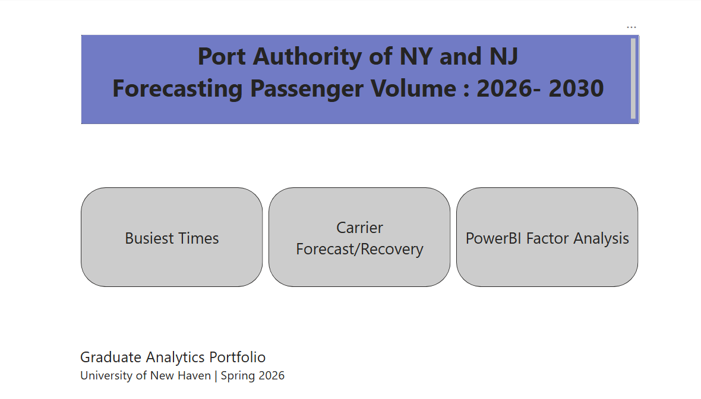
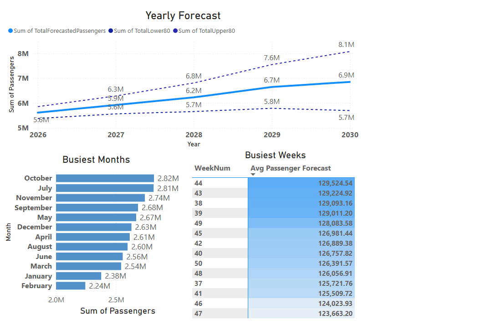
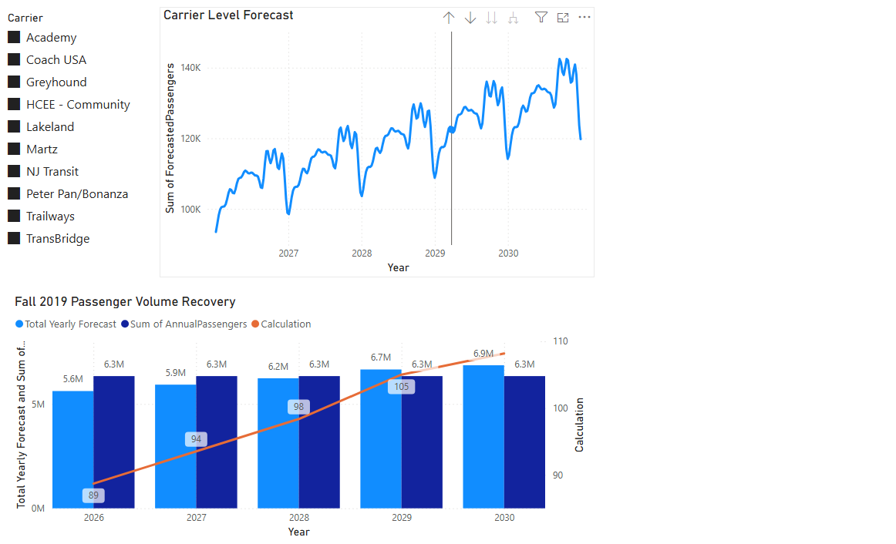
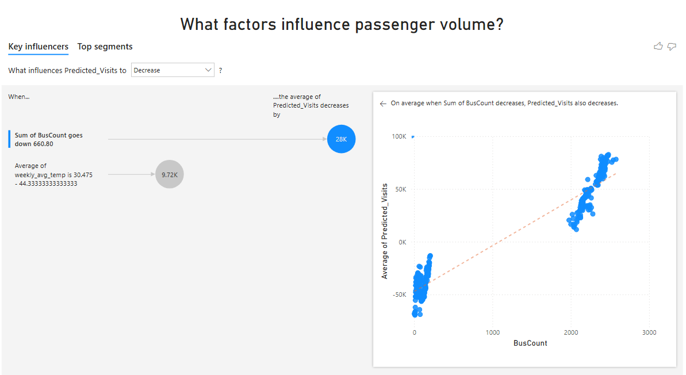

# Port Authority Bus Terminal Demand Forecasting and Capacity Planning

Forecasting and business-intelligence project focused on weekly passenger demand at the Port Authority Bus Terminal for 2026–2030.

> This repository is a portfolio presentation of my work within a graduate analytics project at the University of New Haven.

## Business objective

The project examines how passenger demand may change through 2030 and what that growth could mean for terminal capacity, carrier planning, peak-period operations, and staffing. It addresses five questions:

1. How will terminal-wide passenger volume change through 2030?
2. Which factors are most associated with weekly ridership?
3. How do forecasts differ by carrier?
4. When are the busiest operating periods?
5. When could ridership return to or exceed the Fall 2019 baseline?

## Data

The analytical dataset contains:

- 2,550 historical carrier-week observations
- 12 bus carriers across 237 weeks
- Weekly records from November 2020 through July 2025
- Bus counts, passenger counts, passengers per bus, weather variables, and holiday indicators
- Carrier-level forecast outputs and 80% prediction intervals
- A Fall 2019 comparison baseline

The workbook and its sheet descriptions are available in [`data/`](data/README.md).

### Data source and attribution

Historical passenger data was sourced from the Port Authority of New York and New Jersey and made available through [New York Open Data](https://data.ny.gov/). The workbook in this repository is a processed academic dataset that also includes engineered variables, forecast outputs, prediction intervals, and a Fall 2019 comparison baseline.

## Analytical workflow

1. Validated weekly carrier, passenger, and bus-count fields and reviewed missing or zero-operation records.
2. Prepared weekly time-series inputs with weather and holiday variables.
3. Evaluated ETS, ARIMA, SARIMAX, and Prophet forecasting approaches.
4. Selected Prophet for the final carrier-level forecasts based on holdout performance and operational suitability.
5. Aggregated carrier forecasts into terminal-level demand and 80% prediction intervals.
6. Interpreted regression outputs to assess operational demand drivers.
7. Presented forecast, recovery, peak-period, and factor-analysis results in Power BI.

## Methods and tools

- Time-series forecasting with Prophet
- Multiple linear regression for demand-driver analysis
- Forecast evaluation using holdout testing and MAPE
- Exploratory and operational analysis in Python
- Interactive reporting in Power BI
- Excel for structured analytical outputs

## Key findings

- Annual ridership is projected to rise from approximately 5.6 million in 2026 to 6.85 million in 2030, a 22% increase.
- Average weekly peak volume is projected to grow from roughly 108,000 to 132,000 passengers, with the highest weeks reaching approximately 142,500.
- NJ Transit represents about 75% of terminal passenger volume and is the main driver of system-wide capacity requirements.
- The regression model explains 92.5% of weekly ridership variation; bus count, temperature, and snowfall were the principal factors identified.
- Ridership is projected to exceed the Fall 2019 baseline in 2029 and reach approximately 108% of that baseline in 2030.

These results are analytical estimates for educational purposes, not official Port Authority forecasts.

## Power BI dashboard

The dashboard contains four pages:

- Home Page
- Busiest Times
- Carrier Forecast / Recovery
- Power BI Factor Analysis

Download [`dashboard/port-authority-demand-dashboard.pbix`](dashboard/port-authority-demand-dashboard.pbix) and open it with Power BI Desktop to explore the report.

## Dashboard preview

### Home page

### Busiest times

### Carrier forecast and recovery

### Demand-factor analysis

## Repository contents

| Path | Description |
|---|---|
| [`data/port_authority_analysis_dataset.xlsx`](data/port_authority_analysis_dataset.xlsx) | Historical data, forecast results, and Fall 2019 baseline |
| [`dashboard/port-authority-demand-dashboard.pbix`](dashboard/port-authority-demand-dashboard.pbix) | Interactive Power BI report |
| [`docs/final-project-report.pdf`](docs/final-project-report.pdf) | Final written analysis and recommendations |
| [`docs/project-presentation.pptx`](docs/project-presentation.pptx) | Final team presentation |
| [`docs/eda-appendix.pdf`](docs/eda-appendix.pdf) | Carrier-level exploratory analysis and decomposition charts |

## Scope of my contribution

My contribution focused on forecasting analysis, operational analysis, and strategic recommendations. This included interpreting demand growth and peak-capacity implications, translating analytical results into operational insights, and developing recommendations for staging capacity, scheduling, staffing, continuous forecast monitoring, and business-intelligence adoption.

## Notes

- Academic project completed at the University of New Haven for *Database Management for Business Analytics* in Spring 2026.
- The repository contains final analytical outputs and presentation materials. It does not include a complete reproducible model-training pipeline.
- No affiliation with or endorsement by the Port Authority of New York and New Jersey is implied.
